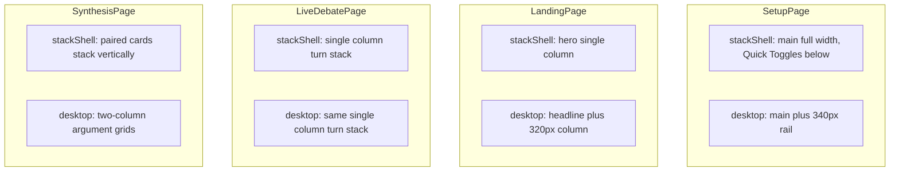

# Design System

## Philosophy

Editorial, serif-led aesthetic. Warm paper backgrounds with oxblood accent. Minimal chrome, maximum readability. Zero border-radius (except pills).

## Typography

### Font Stack

| Role | Font | Fallback |
|------|------|----------|
| **Display / Body** | Source Serif 4 | Georgia, serif |
| **UI** | Söhne | Inter, system-ui, sans-serif |
| **Mono** | JetBrains Mono | IBM Plex Mono, Menlo, monospace |

### Type Scale

| Token | Size | Line Height |
|-------|------|-------------|
| `--fs-xs` | 11px | — |
| `--fs-sm` | 13px | — |
| `--fs-base` | 15px | 1.45 |
| `--fs-md` | 17px | — |
| `--fs-lg` | 20px | — |
| `--fs-xl` | 26px | 1.2 |
| `--fs-2xl` | 34px | 1.08 |
| `--fs-3xl` | 46px | — |
| `--fs-4xl` | 64px | — |
| `--fs-5xl` | 88px | — |

### Fluid Sizes (Responsive)

| Token | Range |
|-------|-------|
| `--fs-display` | 42px → 84px |
| `--fs-title` | 24px → 38px |
| `--fs-quote` | 28px → 48px |
| `--fs-input` | 20px → 32px |
| `--fs-hero` | 36px → 72px |

## Responsive layout

Numeric breakpoints live in [`src/theme/breakpoints.ts`](src/theme/breakpoints.ts) and match **`src/tokens.css`** utility media queries (`min-width: 641px`, `min-width: 1025px`).

| Band | Viewport width | Typical use |
|------|----------------|--------------|
| **mobile** | `width < 641` | Single-column content grids; tight `TurnRow` gutters |
| **tablet** | `641 ≤ width < 1025` | Multi-column *content* grids (e.g. 2 agent cards); **same shell as mobile** |
| **desktop** | `width ≥ 1025` | **Split shell**: main column + fixed-width rail (Setup toggles, Landing hero aside) |

**Shell vs content:** [`useBreakpoint()`](src/hooks/useBreakpoint.ts) exposes `stackShell` (`true` when not desktop). Use **`stackShell`** for page chrome (main + sidebar / hero columns). Keep **`isMobile` / `isTablet`** for *inner* grids (e.g. 1 vs 2 vs 3 cards on Setup) so tablets still get two columns where appropriate.

### Per-page shell behavior



**Masthead:** Pass `compact={stackShell}` for smaller horizontal padding and wrapping on narrow viewports.

## Color Palette

### Light Theme (Default)

| Token | Value | Usage |
|-------|-------|-------|
| `--ink-900` | #191511 | Primary text |
| `--ink-700` | #3a332c | Secondary text |
| `--ink-500` | #6b6258 | Muted text |
| `--ink-300` | #a39b90 | Borders, dividers |
| `--ink-200` | #cfc8bd | Light borders |
| `--ink-100` | #e3ddd1 | Subtle backgrounds |
| `--paper` | #f4efe4 | Page background |
| `--paper-0` | #faf6eb | Card background |
| `--paper-2` | #ece6d8 | Elevated surfaces |
| `--paper-3` | #e4ddc9 | Sidebar, panels |
| `--accent` | #7a1f1f | Oxblood accent |
| `--accent-soft` | #a64040 | Hover states |
| `--accent-bg` | #f2e4df | Accent backgrounds |

### Role Colors

| Role | Color | Background |
|------|-------|------------|
| Advocate | #1e3a5c | #dfe4ec |
| Skeptic | #7a1f1f | #f0e1dc |
| Judge | #4a4438 | #e5dfcf |
| Fact-checker | #3d5a3a | #dde6d7 |

### Status Colors

| Status | Color |
|--------|-------|
| OK / Success | #3d5a3a |
| Warning | #8b5a1f |
| Danger / Error | #7a1f1f |

### Dark Theme

Inverted ink/paper values with softened accent (#c97070). Toggle via `[data-theme="dark"]`.

## Spacing

| Token | Value |
|-------|-------|
| `--sp-1` | 4px |
| `--sp-2` | 8px |
| `--sp-3` | 12px |
| `--sp-4` | 16px |
| `--sp-5` | 20px |
| `--sp-6` | 24px |
| `--sp-7` | 32px |
| `--sp-8` | 40px |
| `--sp-9` | 56px |
| `--sp-10` | 72px |
| `--sp-11` | 96px |

## Components

### Button

| Variant | Style |
|---------|-------|
| **Primary** | Ink-900 bg, paper text, zero radius |
| **Secondary** | Paper bg, ink-900 border, zero radius |
| **Ghost** | Transparent, ink-700 text |
| **Accent** | Accent bg, paper text |

Sizes: `sm` (28px height), `md` (36px), `lg` (44px)

### Card

- Background: `--paper-0`
- Border: optional 1px `--ink-200`
- Border-radius: 0
- Padding: 16–24px

### Pill

- Border-radius: 999px (pill-shaped)
- Variants: default, active (ink-900 bg), accent (accent bg), ghost

### Toggle

- 34×18px switch
- Animated thumb (16×16px)
- Ink-900 track when on

### Segmented

- Inline selector with ink-900 borders
- Zero border-radius
- Active state: ink-900 bg, paper text

### ModelSelect

- Dropdown with provider grouping
- Chevron indicator
- Color-coded by role

### CitationRef

- Inline bracketed reference (`[N]`) for debate sources; editorial **pill** styling with **zero border-radius**
- Mono at ~0.85em; **accent underline** on hover/focus (`--cite-accent`, falls back to `--accent`)
- **Popover** on hover/focus-within: `--paper-0` background, `--ink-900` title, snippet clamp, hostname in mono (preview only; **click `[N]`** to open the URL — no separate control in the popover); `.debater-cite-wrap` / `.debater-cite` / `.debater-cite-popover` in `tokens.css`
- Unknown `N`: `.debater-cite--missing`, dimmed non-interactive text

## Responsive Tokens

| Token | Mobile | Tablet | Desktop |
|-------|--------|--------|---------|
| `--pad-x` | 16px | 32px | 48px |
| `--pad-y` | 16px | 32px | 48px |
| `--gap-md` | 16px | 24px | 32px |
| `--gap-lg` | 24px | 32px | 48px |

### Breakpoints

| Name | Range |
|------|-------|
| Mobile | < 640px |
| Tablet | 640–1024px |
| Desktop | > 1024px |

## Utility Classes

```css
.t-display    /* Large display text */
.t-title      /* Section titles */
.t-head       /* Subsection headers */
.t-body       /* Body text */
.t-ui         /* UI labels */
.t-meta       /* Meta information (mono, uppercase) */
.t-mono       /* Monospace text */
.pad-x        /* Horizontal padding */
.pad-y        /* Vertical padding */
.fadeup       /* Fade-in animation */
```

## Design Principles

1. **Zero border-radius** on most elements (editorial feel)
2. **Pill-shaped** only for status badges and pills
3. **Left borders** for accent highlights (not backgrounds)
4. **Mono uppercase** for meta information
5. **Italic** for quotes and agent search queries
6. **Break-word** on all headlines to prevent overflow
